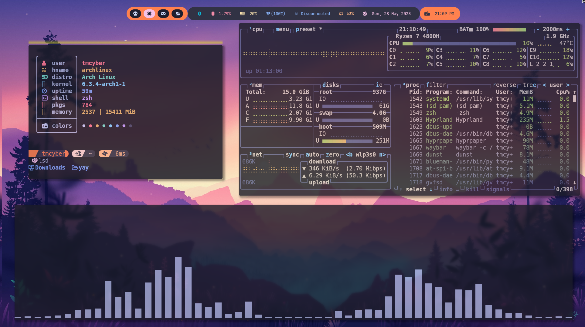
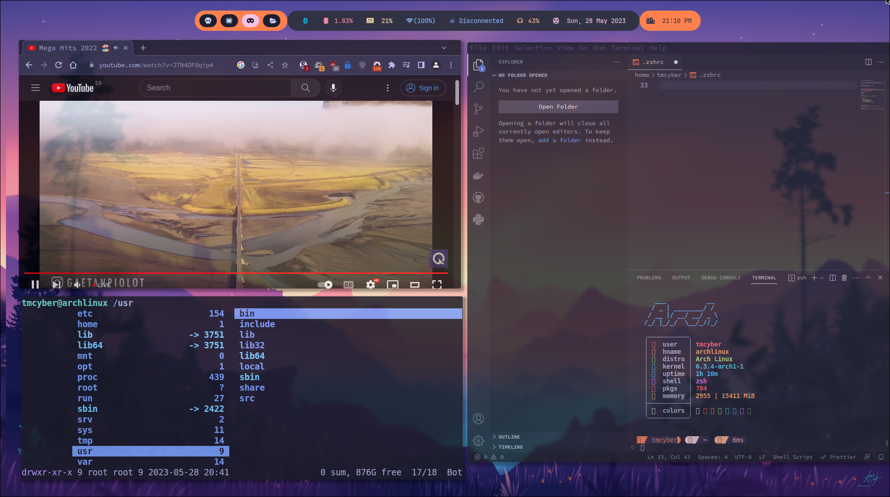
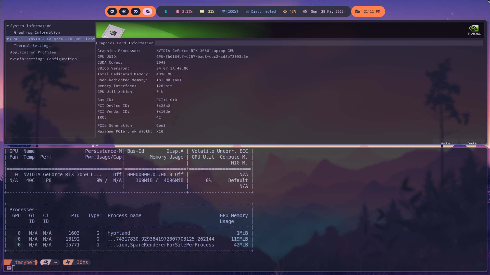

<h1 align="center">
  <br>
  <a href="https://github.com/tmcybers/Hypr-S3C"></a>
  <a href="https://github.com/tmcybers/Hypr-S3C"></a>
  <a href="https://github.com/tmcybers/Hypr-S3C"></a>
</h1>

<h4 align="center"> ☬тм¢увєя☬ Hypr S3C </h4>

### Hypr-S3C
> Is the main idea on fully advanced tilling window manager and wayland based system, hyprland is the most futuristic tilling windows manager wayland based , and the most fluent and productive TWM, ideea behind is taking it to another level in terms of security and daily productivity is concerned, Hypr-S3C is in continuous development in implementations and improvements of appearance and speed of work, as well as implementations of cybersecurity tools and frameworks, all wayland supported and safe. 

#### Im pretty sure you are coming from Xorg: 
Wayland info (especially useful for Xorg users)
A Wayland compositor is a fully autonomous Display Server, like Xorg itself. It is not possible to mix’n’match Wayland compositors like you could on Xorg with window managers and compositors. It is also not entirely possible, nor recommended, to try and use all Xorg applications on Wayland. See this page for a list of recommended Wayland native/compatible programs.

IMPORTANT Wayland compositors should not be confused with Xorg window managers.

>>>> see more on wiki of:  https://wiki.hyprland.org/

>>>>>> From here proceed, only with fresh vanilla installation on arch linux (recommended) also debian an gentoo are fully supported.

>>>>>>>> This is Hardware fully instalation, no VM's here, so take in account this.

# Master Instalation


## Nvidia

*Nvidia only, proceed if you own an nvidia card, if not skip this master installation , and proceed above*

> IMPORTANT: Install nvidia from tty, dont'proceed with hypr.

**This is my personal conf\installation on nvidia, with modifications i did, and skiping foolishness**

*Hardware where i got to work nvidia and hypr, with no issues, i can cofirnm is running as `FIRE`:*

* Asus RogStrix G15 with NVIDIA GeForce RTX 3050 Laptop GPU
* Acer Nitro 5 with Nvidia Geforce GTX 1050 (mobile) Laptop GPU

Requirements\Dependencies:

```
linux-headers
base-devel
qt5-wayland
qt6-wayland
qt5c
qt6ct 
libva 
```

Proceed with nvida:

```
libva-nvidia-driver-git
nvidia-dkms
```

Add modules for nvidia:

```
cd /etc/mkinitcpio.conf
sudo neovim mkinitcpio.conf
```
> if mkinitcpio.conf is not there, create it.

Add this into MODULES=() exactly like this, into brackets: 

```
nvidia nvidia_modeset nvidia_uvm nvidia_drm
```

Create the Image:

```
sudo mkinitpcio -P linux
```

IMPORTANT: 
>> If you have `linut-lts`, `linux-zen` use: `sudo mkinitpcio -P linux-lts` , and asap.

Now final Important step:

> If nvidia.conf is not there, make `touch nvidia,conf`  and ready.

```
cd /etc/modprobe.d/nvidia.conf
sudo neovim nvidia.conf
```

Add this:

```
options nvidia-drm modeset=1
```

>>> Take in account that u must reboot after all this, but proceed with hypr install and all dependencies and reboot later, but dont'forget it.

## Hypr Master

| Type | Package(s) |
| ----------- | ----------- |
| Hyprland Dependencies | hyprland-git qt5-wayland qt5ct qt6-wayland qt6ct qt5-svg qt5-quickcontrols2 qt5-graphicaleffects gtk3 polkit-gnome pipewire wireplumber gvfs |
| Library and Depend(s) |  python-requests pacman-contrib  jq gcc12  |
| Clipboard | wl-clipboard cliphist |
| Bar | waybar-hyprland-git |
| Launcher | wofi-git |
| Lock-Screen | swaylock-effects |
| XDG Desktop Portal  | xdg-desktop-portal-hyprland-git |
| Wallpaper Setter | hyprpaper-git |
| Terminal | kitty |
| Notification(s) | dunst |
| Audio | pamixer pavucontrol pipewire-pulse |
| Bluetooth |  bluez bluez-utils blueman |
| Brightness (only Laptop) |  brightnessctl |
| Network Manager | network-manager-applet |
| Archive Explorer | ranger |
| Themer | nwg-look |
| Screen Capture and Tools | grimblast slurp swappy |
| Audio Player | mpv |
| Log-Out Manager | wlogout |
| Browser | chromium |
| Fonts | ttf-font-awesome otf-font-awesome|
| Icons | ttf-nerd-fonts-symbols ttf-font-icons sway-dynamic-names-git |

| Opcional Archive Explorer GUI | thunar thunar-archive-plugin file-roller fmpegthumbnaile|

> With all this installed, now you can reboot, and login into Hyperland.
> 
> > Take in account that im not using login manager, like sddm or others, i use tty, im not fan of login managers and GUI stuffs.

## tmCyber Hypr-S3C

> Mi wiki with additionals stuff(s), and tools.

| Type | Package(s) |
| ----------- | ----------- |
| Fonts | nerd-fonts-complete-mono-glyphs |
| Extra Icons | https://github.com/Templarian/MaterialDesign-Font |
| Mail |   thunderbird |
